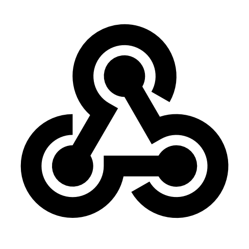

<h1 align="center">Links two channels</h1>

en: A simple discord bot that use webhook to send message from a channel to the other channel.

th: บอทง่ายๆที่ใช้เว็บฮุคเพื่อส่งข้อความจากช่องหนึ่งไปยังอีกช่องหนึ่ง.

<h1 align="center">How's it works?</h1>

en: To make it the easiest to understand is. The bot will look at the messages sent in the first channel, then the bot will then send the same message to the second channel using webhook. and do the same for the second channel.

th: เพื่อให้เข้าใจง่ายที่สุดคือ บอทจะดูข้อความที่ส่งในช่องแรก จากนั้นบอทจะส่งข้อความเดียวกันไปยังช่องที่สองโดยใช้เว็บฮุค และทำเช่นเดียวกันกับช่องที่สอง.

<h1 align="center">Create the bot</h1>

> If you're hosting the bot in heroku, I suggest you to set 'Website' environment to anything that's not 'true'.

<h1 align="center">Tutorial</h1>

en: Coming soon!

th: เร็วๆนี้!

<h1 align="center">Support my youtube channel</h1>

